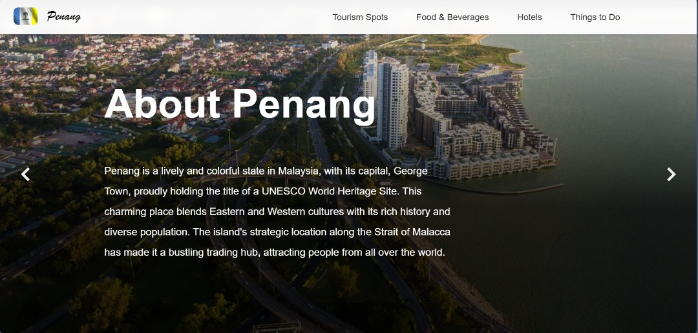
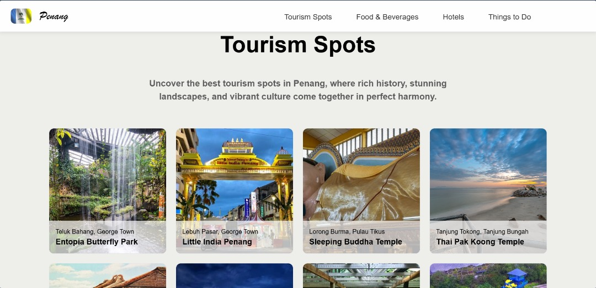
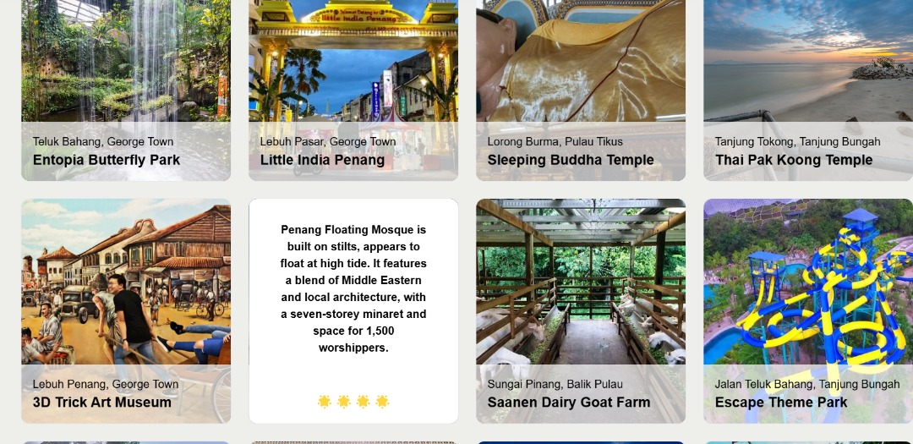
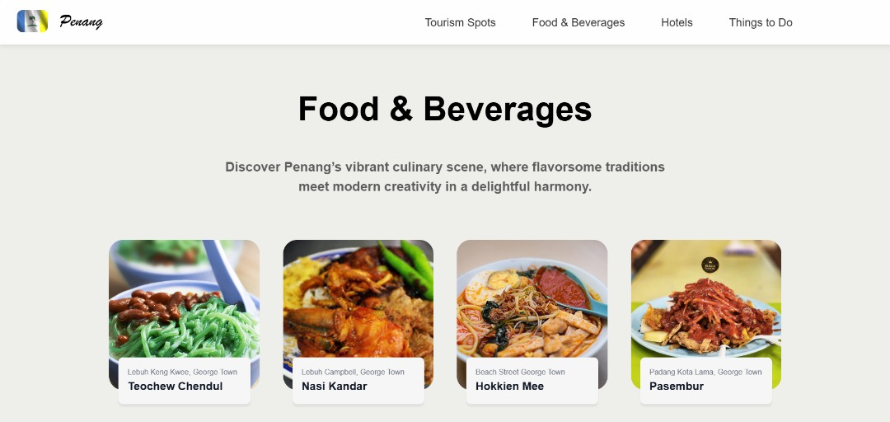
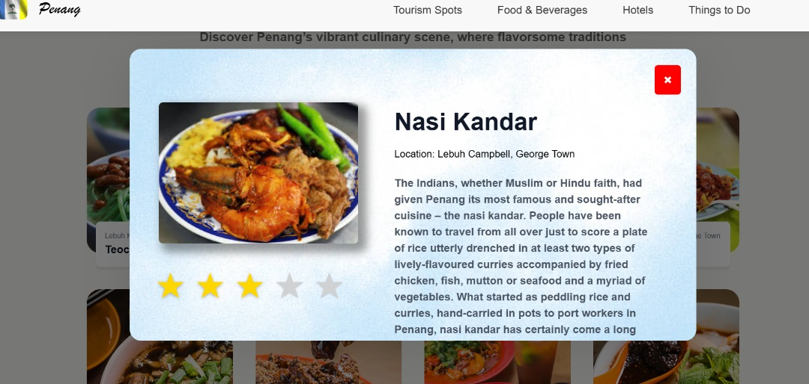

# 🌴 Discover Penang 🏝️- A Tourism Web Experience 

## 📝 Project Description

This project is a modern, responsive web application built with **React.js** and **Node.js**, designed to showcase the diverse attractions of **Penang, Malaysia**. 

---

## 🌟 Key Features

- **Fully Responsive Design** – Works seamlessly across mobile and desktop.
- **Smooth Scroll & Animations** – Scroll-triggered zoom effects and transitions.
- **Interactive Navigation Bar** – Instantly jump to content sections.
- **Hero Section Carousel** – Flip through "About Us", "History", and "Pearl of the Orient".
- **Dynamic Content Sections**:
  - 📍 **Tourism Spots** – In-depth info and images of Penang’s iconic locations.
  - 🍜 **Food & Beverages** – Explore local dishes with ratings and descriptions.
  - 🏨 **Hotels** – Cards with hotel details and user ratings.
  - 🎉 **Things To Do** – Interactive activity cards with image carousels.
- **Embedded YouTube Video** – _“Welcome to Penang!”_ video intro.

---

## 🔗 Live Links

- 🌐 **Web App**: [Visit Live Site](https://assignment-2-ckpkp5owl-tehcs-primes-projects.vercel.app/)
- 🧑‍💻 **GitHub Repo**: [TehCs-Prime/CAT201-PenangWebsite](https://github.com/TehCs-Prime/CAT201-PenangWebsite)
- 📽️ **Presentation Video**: [Watch on YouTube](https://youtu.be/hQnVeRb8lRs)

---

## 🧑‍🤝‍🧑 Team & Contributions

| Name           | Tasks |
|----------------|-------|
| **Teh Chun Shen** | - Developed opening scene section - Implemented navigation bar - Coded Food & Beverages section - Final alignment & design adjustments |
| **Law Zhe Yin**   | - Created introduction section - Developed Tourism Spots section - Video recording & editing |
| **Choo Yit Shern**| - Coded Hotels section - Prepared and finalized project report |
| **Liew Zhe Xian** | - Coded footer section - Developed Things To Do section - Final alignment & design adjustments |

---

## 🚀 Technologies Used

---

## 🖼️ Screenshots
### 🏁 Starting Page

### 🎯 Hero Page

### 📍 Tourism Spot Section

### 🍜 Food & Beverage Section

### 🏨 Hotels Section

### 🎉 Things to Do Section

### 📺 Video Section

### 📬 Footer Section

